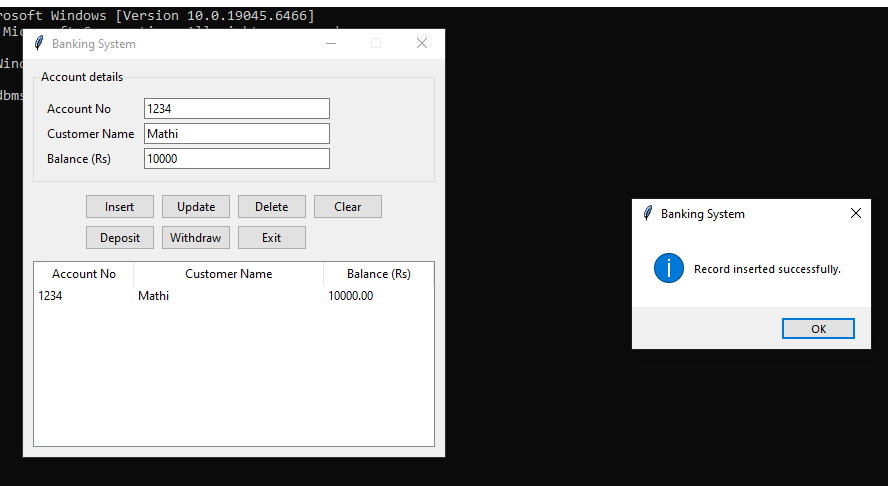
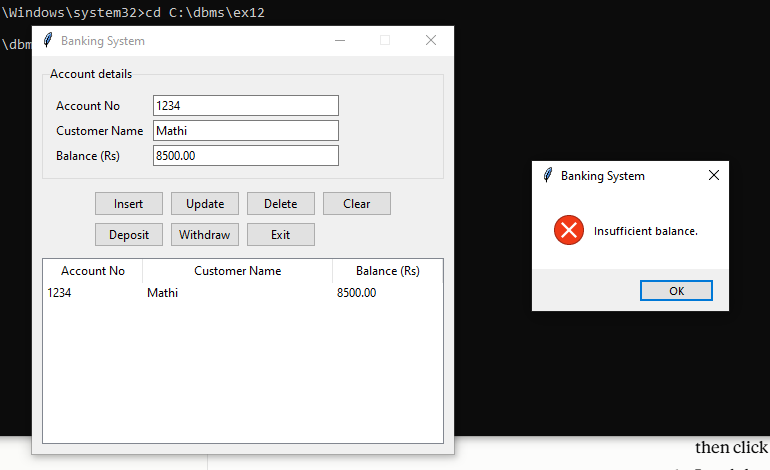
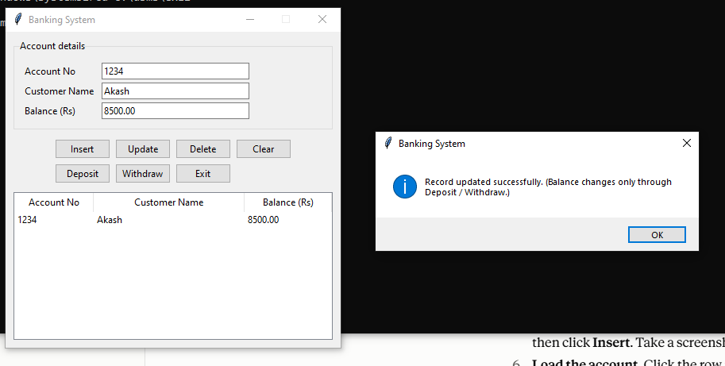

# Ex 12(g) – Banking System (Database Connectivity with Front End Tools)

**Course:** 23IT3L02 – Database Management Systems Laboratory  
**Mapped CO:** L306.4

## Aim
To implement a banking system using database connectivity with a front-end tool.

## Tools
| Layer | Tool |
|-------|------|
| Front end | Python 3 + Tkinter |
| Back end | SQLite (`sqlite3` module) |

## Table
```sql
CREATE TABLE account (
    accno   INTEGER PRIMARY KEY,
    cname   TEXT    NOT NULL,
    balance REAL    NOT NULL DEFAULT 0 CHECK (balance >= 0)
);
```

## Features
Insert · Update · Delete · Clear · Deposit · Withdraw · Exit  
Every change is committed on success and rolled back on failure.

## How to run
```bash
python bank_app.py
```
The database file `bank.db` is created automatically on first run.

## Files
- `bank_app.py` – application (database layer + GUI)
- `schema.sql` – table definition and sample row

## Output
Add your screenshots here (e.g. `screenshots/output1.png`).





