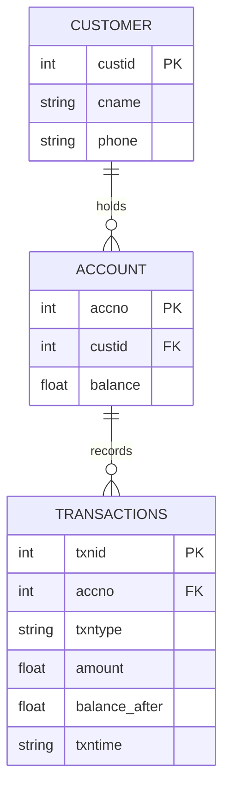
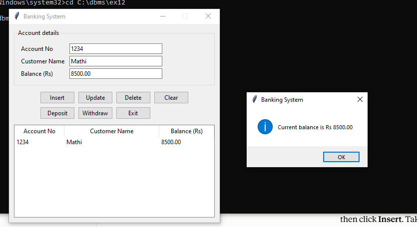
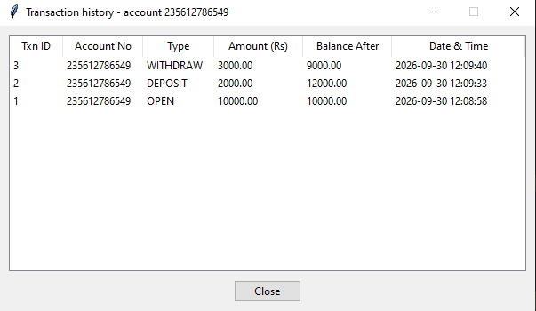

## Aim
To study a real-life database application (a bank) and implement it by connecting a
front-end tool to a relational database.

## Problem statement
A small bank wants to keep its customers, their accounts and every money movement in a
database. Staff must be able to open, edit and close accounts, deposit and withdraw
money (never allowing a negative balance), and see the transaction history of any
account.

## Tools
| Layer | Tool |
|-------|------|
| Front end | Python 3 + Tkinter |
| Back end | SQLite (`sqlite3` module) |

## ER diagram


## Tables (`schema.sql`)
| Table | Purpose | Key rules |
|-------|---------|-----------|
| `customer` | Customer details | `custid` primary key, name `NOT NULL` |
| `account` | Bank accounts | `accno` primary key, `custid` foreign key, `CHECK (balance >= 0)` |
| `transactions` | Log of every opening balance, deposit and withdrawal | `txnid` primary key, `accno` foreign key, type limited to `OPEN / DEPOSIT / WITHDRAW` |

Customer details are kept apart from account details, so they are not repeated for each
account (normalised design).

## Features
| Button | What it does (SQL) |
|--------|--------------------|
| Insert | `INSERT` into `customer`, `account` and `transactions` together |
| Update | `UPDATE` the customer's name and phone |
| Delete | `DELETE` the account, its history and the customer if no other account remains |
| Deposit / Withdraw | `UPDATE` the balance and `INSERT` a transaction row together |
| History | `SELECT` from `transactions` for the account (or all accounts) |
| Table view | `JOIN` of `account` and `customer` |
| Clear / Exit | Clears the boxes / closes the program |

Each multi-step change is one transaction: it is committed only if every step succeeds
and rolled back otherwise. A withdrawal larger than the balance is rejected and nothing
is saved.

## How to run
```bash
python bank_app.py
```
On start-up the program runs `schema.sql` to create the tables, so `schema.sql` must stay
in the same folder as `bank_app.py`. The database file `bank.db` is created automatically.
If you have an older `bank.db` from the single-table version, delete it first.

## Files
- `bank_app.py` – application (database layer + GUI)
- `schema.sql` – table definitions (run by the program on start-up)

## Output
Add your screenshots here (e.g. `screenshots/1_insert.png`).


